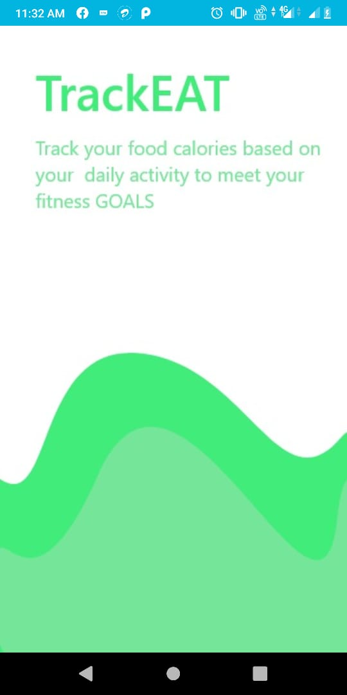
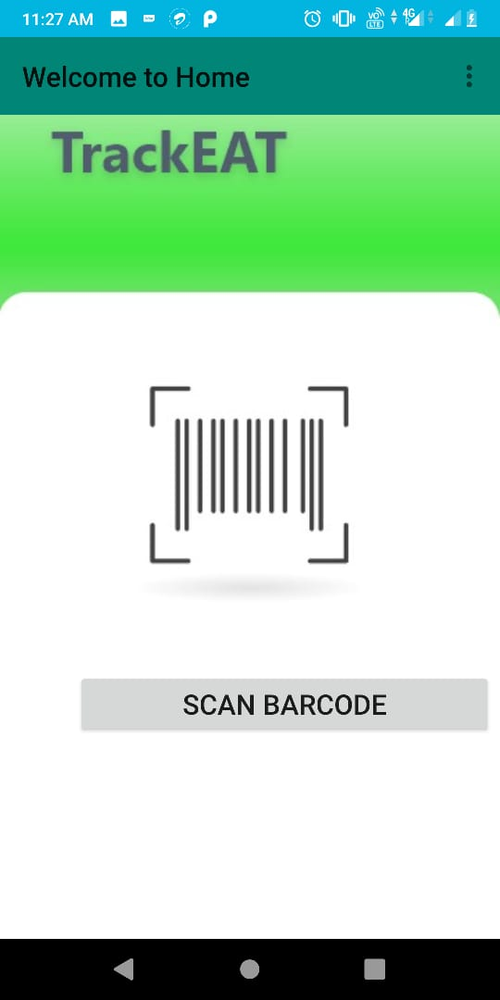
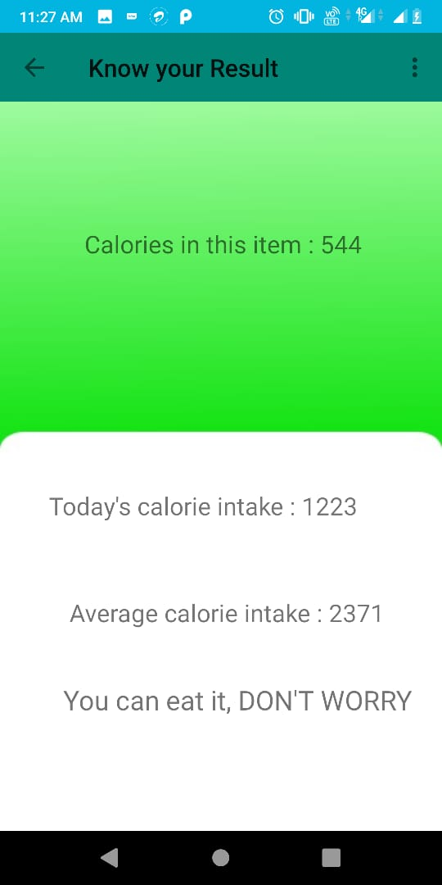

# Problem statement
2. Suitable food suggestions
Create an application which scans the bar code (not mandatory)  of a packed item and suggests whether it is suitable for you by analyzing your daily calorie intake using FitBit etc.

# Screenshots

