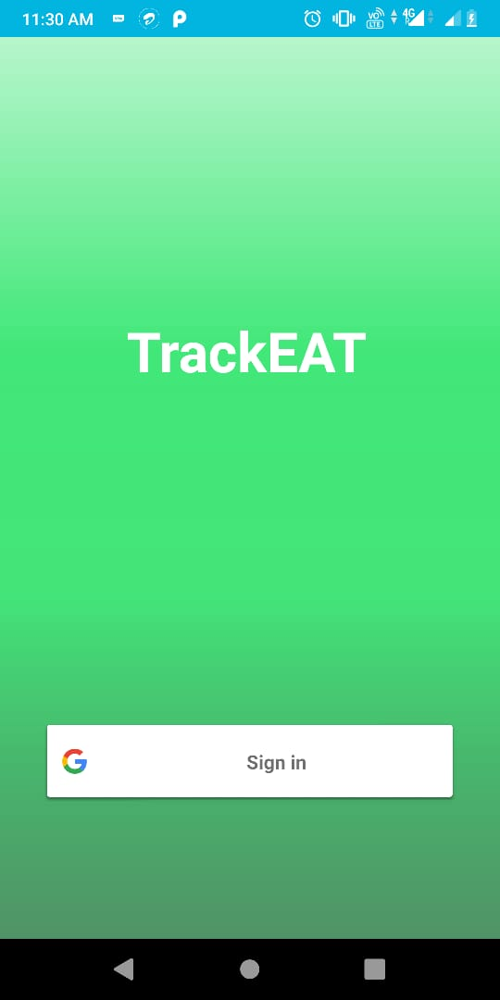

# Problem statement
2. Suitable food suggestions
Create an application which scans the bar code (not mandatory)  of a packed item and suggests whether it is suitable for you by analyzing your daily calorie intake using FitBit etc.

# TrackEAT Mobile App
## Features
- **Let’s you know whether you should take the scanned product or not.**
- **Synchronizes with your Fitness band so no need to have a completely different product for this feature.**
- **Directly know about product calories by scanning it’s barcode.**

## Technology Used
- **We have used Android Studio to make our Android App.**
- **We have used openfoodfacts API to get the information about the scanned product.**
- **Used Firebase to create login system.**
- **Used Zxing library to implement barcode scanner.**

## Effect on User's Life
- **User will be aware of the food they should take in order to live a Healthy Life.**
- **This can reduce obesity, heart attack, osteoarthritis and memory loss disease to a considerable extent.**
- **Efficiency of the user will increase.**

## App Demo Link
[TrackEAT Demo](https://www.youtube.com/watch?v=QWb5x8GY4cU)

# Screenshots

